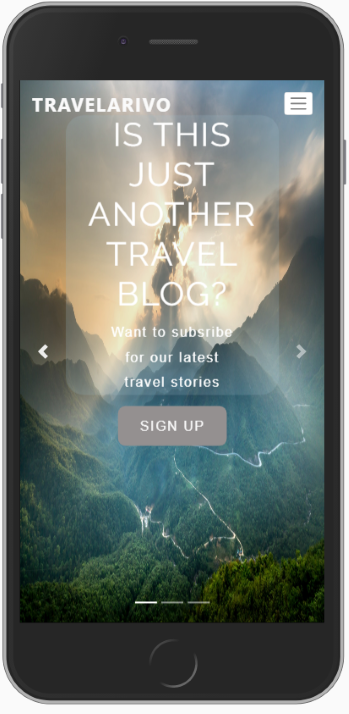

# Travelarivo
Second project for the Code Institure. 
It is traveller's blog comprises of with two APIs. 1) Google Maps API and EmailJS API. Try loading it using by clicking [here ](githublink)
Introduces a three-stage slider which makes the interface more dynamic with appealing images related to the travelling topic. Each slide represents different level of interaction.  

# Usage or UX

Main interface present a slidedeck with each slides offers different levels of interaction. It starts with module to sign up for newsletter stories. Second deck introduces places visited by the creator around the world while the last deck hints for the forthcoming travel stories to be. Each slie has navigation bar and subsections inviting to the differentThe landing page has a headling to bring the user's attention and make it more appealling for further browsing inside the app. 
Upon loading the website provides the standard slideshow with shortened interval between the slides thanks to a small javascript input. Mobiel users can enjoy better functionality on their mobile phones usng the finger slide. 
       - Each slider also includes controls and indicators to provide different user types of webacces access they prefer by click on the "< >" arrows or " _ _ _ " indicators.
       - If no controls input is provided by the user the landing page loads the first slide of carousel with relavely smooth interval thanks to a small javascript code which targets the carousel class from the html code.

The purpose of the website is to deliver an seemless experience which targets frequent visitor-reader type with sign-up page accessible from the landing page for the newsletter, gallery page and an option to read forthcoming travel stories. 
The next level of interaction comes with the inclusion of the Google Maps API that presents the places visited around the globe with added markers on the map. Whereas a more intrigued user type can submit a request to receive a screenshot with their trails left around the globe. I beleive this feature propones the idea for a more interactive user experience. 

# Features 

- Sign-up form - allows the user to subscrbe for the newsletter by filling the simple form with required fields
- Gallery - provides more insight on the places visitet
- Explore the map - appeals to the customer to fill out the form with the places visited and will tailored screenshot with trails around the globe
- Contact - provide the user alternative ways to contac the creator of the app

# Features Lef to Implement

- Publish the travel stories in slide 3 subsection accessible via the read stories button to enhance the content
- Publish the active search engine that allows the guest to use it for plannig the next visit with where to stay on the map

# Technologies used
1. HTML
2. CSS
3. Bootstrap (3.3.7)
4. [Google Maps JavaScript API](https://developers.google.com/maps/documentation/javascript/tutorial)
  - The project uses this API to introduce better the purpose of website travelling and the stories from the trips.
5. [EmailJS](https://dashboard.emailjs.com/account/create)
  - The project uses the EmailJS to facilitate the sign-up form submission and send email request 

# Testing

###### screenshots

### Test 1 Version differences 

Three different versions the traveller;s blog are incldued using media queries. 
- Standard version for desktop which focuses on the pictures featured and direct gallery access. 
- Relatively newer 6-inch mobile display types will have more direct access as the buttons to acces the subsection more visible
- The content is adapted for smaller displays by not displaying main headline and shrinking the navigation bar to a dropdown access.
- Gallery page has two columns when access from mobile. There columns on tablet and four on a desktop.

### Test 2

1. Sign up form:
    1. Go to the "Sign up" page
    2. If the user tries to submit an empty form "!Please fill out this field" pops up.
    3. Trying to submit the form without valid email inpute or missing info in any of the fields leads to unsuccesfull submission

### Test 3 

1. Reqeust form:
    1. Go to the "Contact Us" page
    2. Try to submit the empty form and verify that an error message about the required fields appears
    3. Try to submit the form with an invalid email address and verify that a relevant error message appears
    4. Try to submit the form with all inputs valid and verify that a success message appears.

# Deployment

Okay, so since this is your interactive project, you would just want to discuss the steps taken to deploy to github pages (e.g. there won't be any configuration files). 
It's also is stating that you should include information about how another developer would go about cloning your repository and running it locally. 
"is this like "how another developer would go about cloning your repository and running it locally. " like they can open it directtly from github to their gitpod or other editor and run it there
Haley profile"
Yes, so you'd want to outline the steps on how they would go about doing that. 

# Content and Media

Pictures on the slides landing pages are take and free to use from [Pexels](https://www.pexels.com/).

The content from the gallery comes from my personal archive.

# Acknowledgements

Inspiration for the slide deck design layout is takan from [here](https://www.youtube.com/watch?v=sbf3uv0reTc). 

The improvement for the interval comes a small piece of code taken from [here](https://getbootstrap.com/docs/4.0/components/carousel/) in Bootstrap.

